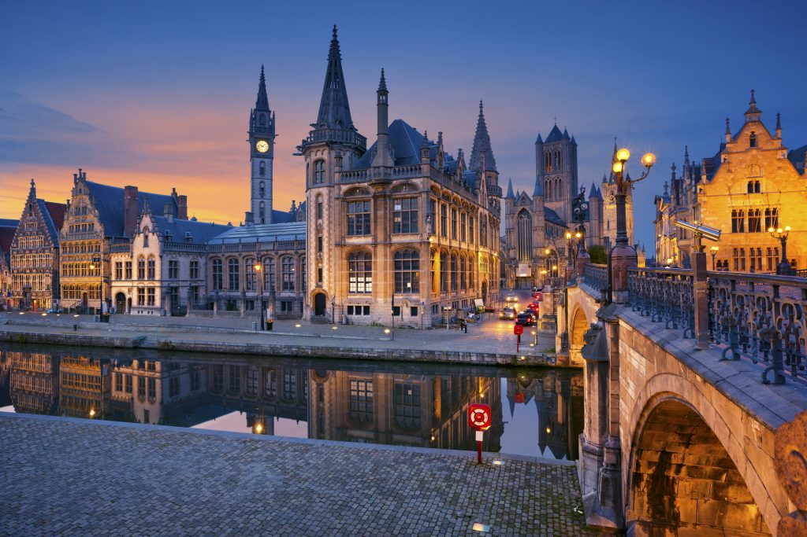

# Belgium
.svg)
Sovereign: King Philippe (2013)

Prime Minister: Charles Michel (2014)

Land area: 11,672 sq mi (30,230 sq km); total area: 11,787 sq mi (30,528 sq km)

Population (2014 est.): 10,449,361 (growth rate: 0.05%); birth rate: 9.99/1000; infant mortality rate: 4.18/1000; life expectancy: 79.92

Capital and largest city (2011 est.): Brussels, 1.949 million

Other large city: Antwerp 959,000 (2011)

Monetary unit: Euro (formerly Belgian franc)

National name: Royaume de Belgique—Koninkrijk België

Languages: Dutch (Flemish) 60%, French 40%, German less than 1% (all official)

Ethnicity/race: Fleming 58%, Walloon 31%, mixed or other 11%

National Holiday: Ascension to the Throne of King Leopold I, July 21

Literacy rate: 99% (2003 est.)

Economic summary: GDP/PPP $421.7 billion; per capita $37,800. Real growth rate: 0.1%. Inflation: 1.3%. Unemployment: 8.8%. Arable land: 27.06%. Agriculture: sugar beets, fresh vegetables, fruits, grain, tobacco; beef, veal, pork, milk. Labor force: 5.15 million (2011 est.); agriculture 2%, industry 25%, services 73% (2007 est.). Industries: engineering and metal products, motor vehicle assembly, transportation equipment, scientific instruments, processed food and beverages, chemicals, basic metals, textiles, glass, petroleum. Natural resources: construction materials, silica sand, carbonates. Exports: $295.3 billion (2013 est.): machinery and equipment, chemicals, diamonds, metals and metal products, foodstuffs. Imports: $310.2 billion (2013 est.): machinery and equipment, chemicals, diamonds, pharmaceuticals, foodstuffs, transportation equipment, oil products. Major trading partners: Germany, France, Netherlands, UK, U.S., Italy, Ireland (2012).

Communications: Telephones: main lines in use: 4.631 million (2012); mobile cellular: 12.88 million (2012). Broadcast media: a segmented market with the three major communities (Flemish, French, and German-speaking) each having responsibility for their own broadcast media; multiple TV channels exist for each community; additionally, in excess of 90% of households are connected to cable and can access broadcasts of TV stations from neighboring countries; each community has a public radio network co-existing with private broadcasters (2007). Internet hosts: 5.192 million (2012). Internet users: 8.113 million (2009).

Transportation: Railways: total: 3,233 km (2,950 km electrified) (2011). Highways: total: 154,012 km; paved: 120,514 km; unpaved: 33,498 km (2010). Waterways: 2,043 km (1,528 km in regular commercial use) (2012). Ports and terminals: major seaports: Oostende, Zeebrugge; river ports: Antwerp, Gent (Schelde River); Brussels (Senne River); Liege (Meuse River). Airports: 41 (2013).

International disputes: none.

Geography: Located in western Europe, Belgium has about 40 mi of seacoast on the North Sea, at the Strait of Dover, and is approximately the size of Maryland. The Meuse and the Schelde, Belgium's principal rivers, are important commercial arteries.

Government: Parliamentary democracy under a constitutional monarch. Under the 1994 constitution, autonomy was granted to the Walloon region (Wallonia), the Flemish region (Flanders), and the bilingual Brussels-Capital region; autonomy was also guaranteed for the Flemish-, French-, and German-speaking “communities.” The central government retains responsibility for foreign policy, defense, taxation, and social security.

History: Belgium occupies part of the Roman province of Belgica, named after the Belgae, a people of ancient Gaul. The area was conquered by Julius Caesar in 57–50 B.C., then was overrun by the Franks in the 5th century A.D. It was part of Charlemagne's empire in the 8th century, then in the next century was absorbed into Lotharingia and later into the duchy of Lower Lorraine. In the 12th century, Belgium was partitioned into the duchies of Brabant and Luxembourg, the bishopric of Liège, and the domain of the count of Hainaut, which included Flanders. In the 15th century, most of the Low Countries (currently the Netherlands, Belgium, and Luxembourg) passed to the duchy of Burgundy and were subsequently inherited by Emperor Charles V. When the latter abdicated in 1555, the territories went to his son Philippe II, king of Spain. While the northern part, now the Netherlands, gained its independence in the following decades, the southern part remained under Spanish control until 1713, when it was transferred to Austria. During the wars that followed the French Revolution, Belgium was occupied and later annexed to France. But with the downfall of Napoléon, the Congress of Vienna in 1815 reunited the Low Countries under the rule of the king of Holland. In 1830, Belgium rebelled against Dutch rule and declared independence, which was approved by Europe at the London Conference of 1830–1831.

Germany's invasion of Belgium in 1914 set off World War I. The Treaty of Versailles (1919) gave the areas of Eupen, Malmédy, and Moresnet to Belgium. Leopold III succeeded Albert, king during World War I, in 1934. In World War II, Belgium was overwhelmed by Nazi Germany, and Leopold III was held prisoner. When he returned at the government’s invitation in 1950 after a narrowly favorable referendum, riots broke out in several cities. He abdicated on July 16, 1951, and his son, Baudouin, became king. Because of growing opposition to Belgian rule in its African colonies, Belgium granted independence to the Congo (now Democratic Republic of the Congo) in 1960 and to Ruanda-Urundi (now the nations of Rwanda and Burundi) in 1962.

Since 1958, when the European Economic Community was born, Brussels, the country’s capital, has gradually established itself as the de facto capital of what has now become the European Union (EU), a role that became official in Dec. 2000 when the European Council of heads of government decided to hold all its regular meetings in Brussels. As a result, the city has become home not only to nearly 20,000 European civil servants, but to an even more numerous community of lobbyists, lawyers, and other professionals drawn to the EU’s main decision center.

Growing divisions between Flemings and Walloons, and devolution along linguistic lines, culminated in the revised constitution of 1994, which turned Belgium into a federal state with significant autonomy for its three regions and its three language “communities.”

